## Sobre o Projeto
Este repositório é o resultado do esforço colaborativo dos integrantes do squad Dart Vaders durante o Módulo 2 do [Programa Desenvolve (2024) - Grupo Boticário](https://desenvolve.grupoboticario.com.br/). O projeto base foi criado com o intuito de proporcionar aos membros uma experiência prática no desenvolvimento com Flutter e nas práticas de uso do GitHub.

## Screenshots

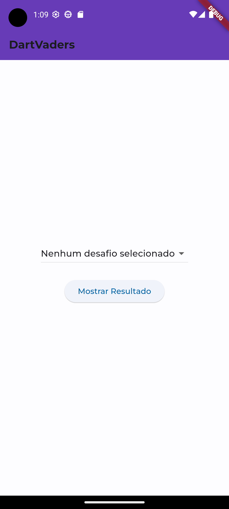
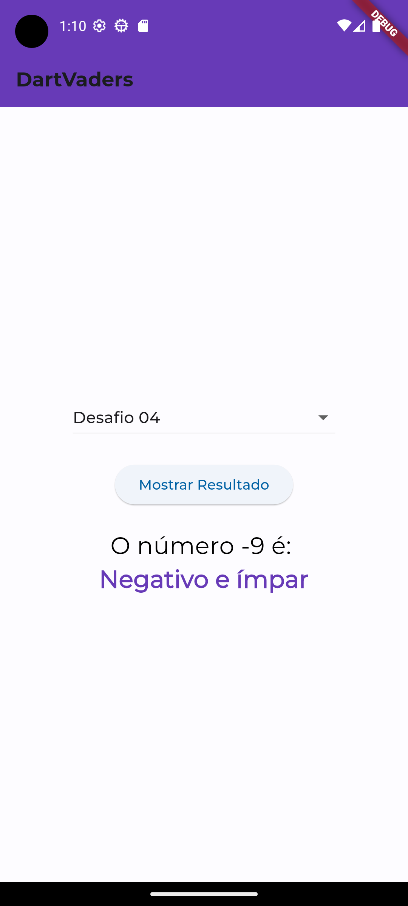
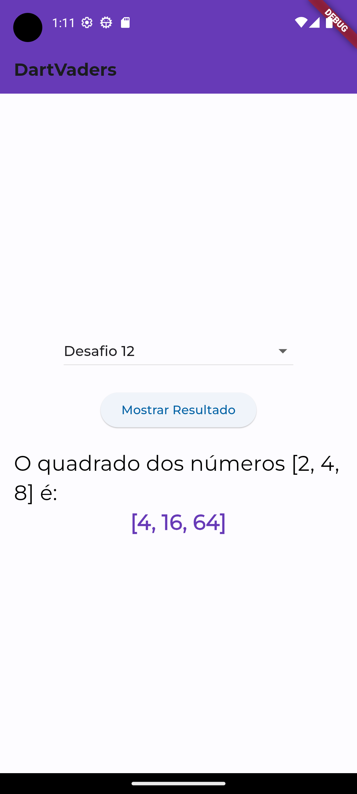

## Objetivo
O objetivo deste projeto é familiarizar os 9 membros do squad com o processo de desenvolvimento de software utilizando Flutter, seguindo boas práticas de versionamento e colaboração em equipe através do GitHub.

## Contribuições
Cada membro contribuiu com uma pequena parte do projeto, implementando funções para resolver algoritmos específicos. Essa abordagem garantiu que todos tivessem a oportunidade de aprender e se desenvolver. As contribuições individuais estão documentadas nos commits do repositório.

## Tecnologias Utilizadas
- Flutter
- Dart

## Squad DartVaders 🚀

|Adalto Mendes| Emerson Mendes | Erika Alves | Franciéllen Sousa | Jaqueline Dreyer | Jhonny Valente |
|---|---|---|---|---|---|
|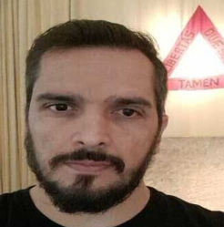|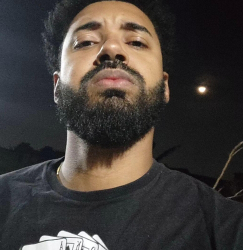|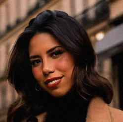|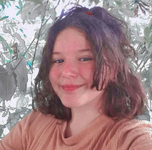|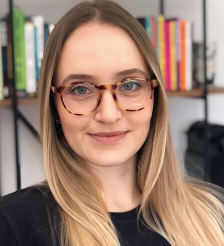| 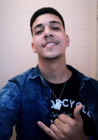|

| João Rebouças | Kamila Teófilo |  Leidiane Silva | 
|---|---|---|
|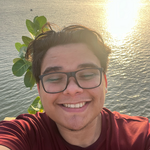|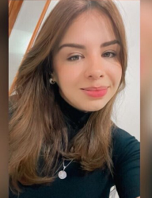|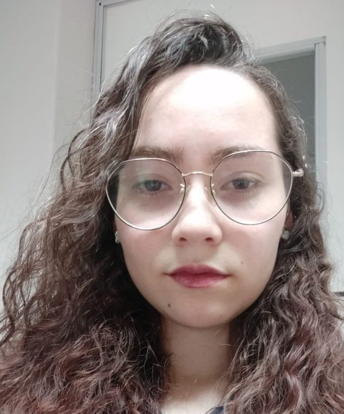|
